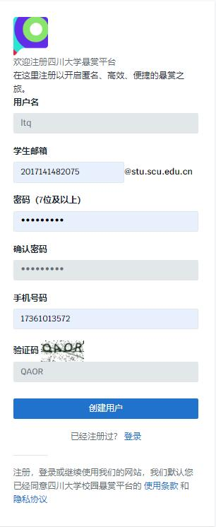
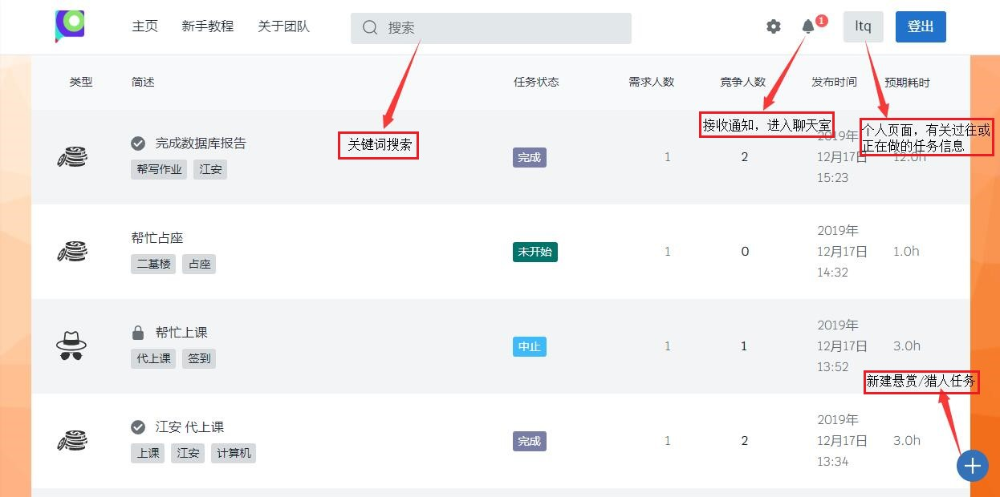
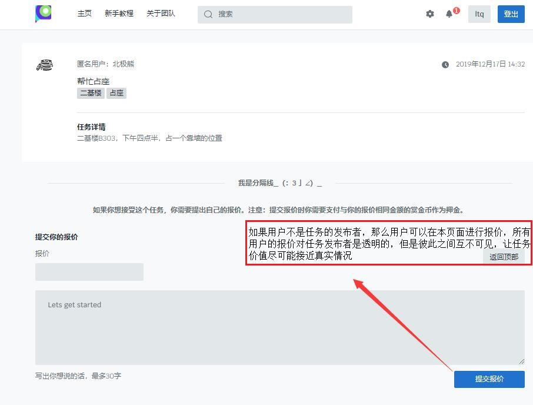
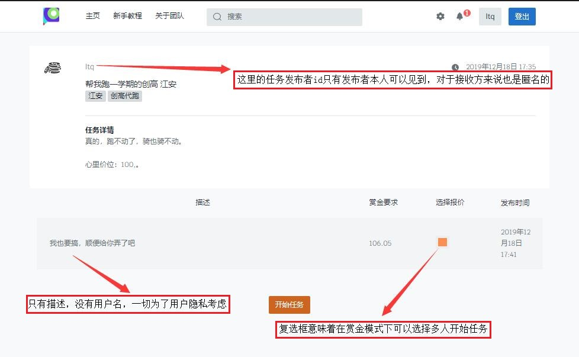
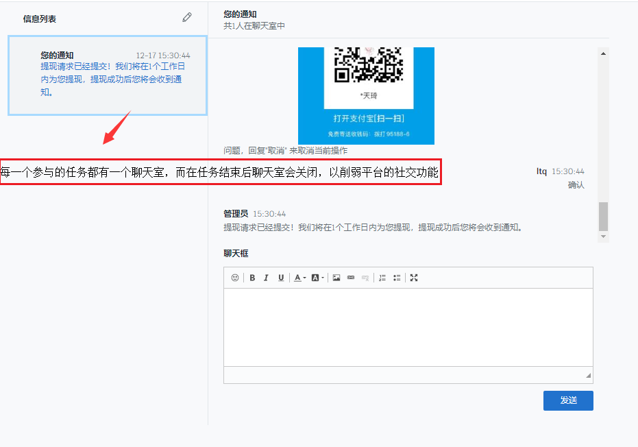

# 项目简介(四川大学任务悬赏平台)

## 在线访问

目前该网站已经部署到阿里云服务器，访问请点击https://scutj.cn

目前还处于删档内测阶段，欢迎大家测试。如果发现问题，根据具体的问题联系相应开发人员：

| 负责     | 姓名   | 联系方式(QQ) |
| -------- | ------ | ------------ |
| 后端     | 贺翔   | 765892480    |
| 前端     | 李天琦 | 228321632    |
| 服务器   | 王子宇 | 842384144    |
| 美术美工 | 侯雪娟 | 2642732250   |

如果大家对开发过程感兴趣，可以访问我们的GitHub库：https://github.com/Herixth/SCU-reward-platform。
上面记录了我们的开发过程(11月24日之后就没有更新开发日志了...)以及较新的版本库(最新的直接部署在服务器上)，当然涉及的隐私内容做过修改。

如果感兴趣的话可以考虑Fork，如果有:star:就更好啦！

## 项目背景与现状

四川大学任务悬赏平台是由本团队自主开发的四川大学学生范围内的任务悬赏交互平台网站。
可以由学生们发布任务和接受任务，进行赏金的交易换取生活上的服务和便利。

### 现实生活中的需求

1. 同学们在日常生活中一些事情如取快递、暂时占座、打印文件、跑单位盖章等需要其他同学帮忙，并愿意支付一定金钱换取服务。
2. 存在有空闲时间较多的同学乐意为其他同学帮忙，并赚取一点零花钱。

### 校内现状

催生出许多校园内的互助群聊，但群聊有着

1. 认证系统不健全易混入无关人员和群聊成员占位问题；

   认证缺乏导致同学们的利益也得不到保障，出现问题后难以追究；因群聊成员数量有限，易催生无数群聊，不同群聊之间又难以互相沟通，使同学们疲于应对，管理员疲于管理。

2. 沟通交流效率低

   群聊没有沟通模式限制，容易造成效率低下；群聊在于聊天，闲聊过多易错过关键信息；若采用禁言后管理员统一发布的形式又过于耗费管理人力，且难以互相高效沟通。

3. 交易过程无保障

   从群聊找到可以互相满足需求的人之后，交易过程是私下双方进行的，没有第三方的保证也就容易造成利益损失；群聊毕竟是社交平台，私下透露个人信息还容易造成隐私泄露。

4. 缺少总结与分类

   聊天记录对管理任务详情并不友好，若涉及多个任务以及任务记录，几乎只能凭自己记忆或手动另做笔记等不方便、不友好且容易损害同学们的利益的硬伤。

## 项目创新特点

#### 校园认证

一人一账号。账号注册均通过四川大学学生邮箱和验证码验证，保证身份真实可信。如果出现违法行为，可以查询精确到人并及时处理，极大的保障了同学们的个人利益。

#### 报价机制

发布者发布任务时，不能规定一个确定的价格，而要表达自己可以接受的价格上限或下限；发布任务后，想接受任务的同学可以发布自己的报价和简介来投标竞争，而不可以看到其他人的报价。

#### 匿名交易

发布、接受任务和交流对话均采用自动分配昵称的匿名方式，从而保护个人信息，最大程度上避免隐私泄露。

#### 限时交流

任务需求双方只可以在任务进行期间进行交流，一旦任务结束则对话框消失；以此反社交的设计让同学们的精力都集中在任务和交易这样的主要功能上，也是我们注重个人信息隐私的一环保护。

## 功能简介

#### 赏金模式

发布赏金模式任务，其他用户可以通过可做任务的投标竞争来赚取任务资格和任务赏金。

#### 猎人模式

发布猎人模式任务，其他用户通过可发任务的投标竞争以赏金来换取猎人服务。

#### 一对一匿名交流

针对每个任务，发布者和接收者可以使用匿名昵称在聊天室进行一对一的细节交流，任务结束则终止交流。

#### 充值和提现

赏金与RMB1：1使用支付宝进行充值和兑现，以方便需要赚取零花钱的同学将劳动成果兑现。

# 前端设计摘要

##网页结构

我们使用了Django作为网站的后端框架，bootstrap作为前端框架进行网站设计。在后端我们创建了两个应用`login`和`task_platform`来分别实现**用户管理**和**任务管理**的功能。而前端的主要功能则通过以下页面实现。

## 网页介绍

### 注册页面



用户注册时会被要求填写自己的用户名，但是在一个全匿名的平台上，用户名是仅自己可见的，所以它唯一的用处在于登陆时好记。另外我们平台不要求用户上传头像也是这个原因。

在设计网站时，我们团队考虑过如何保证所有平台用户全为四川大学校内学生。曾经有过写脚本连接到四川大学教务处进行学生身份验证的想法，但是后来我们发现，使用学生邮箱进行用户验证似乎是更简便易做的方案便改变了想法。(四川大学学生邮箱密码是`stu`+身份证号后六位)

因此，我们可以认为在平台注册的每一个用户，背后都是一个实名制的四川大学学生，通过这样的方案保证了平台本身的安全。

### 主页



主页的设计思路自然是简洁。在登入`scutj.cn`后第一眼即可看到当前最新的任务，而只有注册用户才能点入任务查看详情并接受。

右上角可以进行个人页面的访问（在个人页面可以查看余额并充值），修改密码和学院，和查看通知。

我们对于通知的构想是：所有通知都是一个聊天信息，和任务相关的可能是任务发布方/接收方的聊天，而和平台相关的则是用户名为`Admin`的超级用户的聊天。

导航栏的搜索框是可用的，但是它实际上只运行于前端，作为一个用户不会用`Ctrl+F`时的替代工具而已。当然，它比`Ctrl+F`要好用那么一点点。后续工作中我们会将其部署到后端，使其真正具有搜索功能。

### 任务详情



任务详情页面使我们经过精心思考设计而成的。为了减少用户的操作成本和降低涌入用户大脑中的信息量，我们删去了大量的可能带来无用信息的框架，仅仅保留核心用途：浏览，和报价。这样用户就不会有在浏览其他资讯网站（如bilibili）时“乱花渐欲迷人眼”的感觉。我们并不想将其作为一个社交平台，我们仅仅是想让用户将它当做是一个工具而已。

用它，就完事了。



所以在发布者页面我们也运用了断舍离的设计哲学，让用户能够在最短时间内完成任务的发布操作，在这个页面你甚至只有选择接受者和开始任务两个操作。而在你发布任务时你也不知道到底是一个美少女还是一个抠脚大汉会帮助你完成任务--你也不需要知道，因为这个网站是以任务，而非用户，为核心而设计的。

### 聊天室



虽然我们网站有聊天室，但是它被设计出来的初衷有两个：一是作为信息发布的介质，二是我们发现在任务进行的途中，发布者和接收者存在不可避免的交流行为，同时其还具备一定隐私性质。所以我们设计了这样的一个“一次性聊天室”，除了“通知”这样的和平台本身交互的聊天窗口之外，所有聊天窗口的存活周期仅是从任务开始到任务完成/中止/撤销。如果你想在平台上认识小哥哥小姐姐们，除了在聊天室发布你的个人联系方式（我们非常不建议这样做）之外没有其他方法。

# 后端设计摘要

## 任务设计

### 设计理念

为了更全面，更真实地满足当代大学生的日常生活需要，我们设计了两种任务类型：[赏金模式](#赏金模式)和[猎人模式](#猎人模式)，分别对应着用金钱换取服务和用服务换取金钱两种任务模式。对于每种任务，我们设定了一种通用的任务管理框架，对任务的状态进行判别，以便清晰地管理资金的流动以及满足用户的需求。

### 任务模式

在任务发布界面，我们可以看到有两种任务模式可供选择。


#### 赏金模式

赏金模式用以上左侧图标表示。赏金模式下有一个发布者，可以有多个接受者，即可以发布多人任务。

#### 猎人模式

猎人模式用以上右侧图标表示。猎人模式下有一个发布者，且只有一个接受者。

### 任务状态

我们将任务一共分为6中状态：**未开始**、**进行中**、**撤销**、**中止**、**超时**和**完成**。并且规定如下：

1. 在任务被创建后，任务的状态为$\lceil\text{未开始}\rfloor$，且并不开启聊天室。
2. 在发布者接收报价之后，任务状态改为$\lceil\text{进行中}\rfloor$，同时开启聊天室。
3. 无论任务类型，因任务发布者的原因导致任务无法正常完成时，任务状态由发布者改为$\lceil\text{撤销}\rfloor$，同时关闭聊天室。
4. 赏金模式下，因任务接受者的原因导致任务无法正常进行时，该接受者将自己的任务参与状态改为$\lceil\text{中止}\rfloor$，只有当所有接受者都中止时，任务参与状态才改为$\lceil{中止}\rfloor$，同时关闭聊天室。猎人模式下，没有中止状态[^1]。
5. 猎人模式下，若任务发布者无法在其设置的**预期完成时间**内完成任务，任务状态将被系统自动改为超时，同时关闭聊天室。赏金模式下，没有超时状态[^2]
6. 无论任务类型，任务状态被改为$\lceil\text{完成}\rfloor$时，可以认为任务正常完成，平台进行抽成，同时关闭聊天室。

### 任务流程图

两种类型的任务流程如下：


### 结算总览

对于每个任务，都会有相应的金钱流动。我们将这些金钱分成两部分：**押金**和**赏金**。

#### 押金

押金的存在是为了保护对方用户的权益，在任务**没有正常完成**时押金才会出现流动，任务**正常完成**时押金会原路返回。

发布者在发布任务时会缴纳一笔押金，金额由平台规定。一是为了防止发布者短时间大量发布无意义任务，二是为了任务出现$\lceil\text{撤销}\rfloor$时，补偿任务接受者。

接受者在发布任务报价时会缴纳一笔押金，押金金额与其报价金额相同。主要是为了任务出现$\lceil\text{中止}\rfloor$时，补偿任务发布者。

#### 赏金

赏金是在任务**正常完成**时会出现流动，在任务**没有正常完成**时，赏金会原路返回。

赏金模式下，任务发布者在接受报价时就会支付赏金全额，在任务正常完成时结算给接受者。猎人模式下，由于任务不会出现$\lceil\text{中止}\rfloor$，故直接用接受者发起报价时缴纳的押金作为赏金，在任务正常完成时结算给发布者。

#### 符号定义

为了方便结算表示，我们采用以下定义：
$$
\begin{array}{c|c}
\text{符号} & 定义 \\
\hline
 D & \text{发布任务的押金(5元)} \\
\hline
 P & \text{平台抽成比例(5%)} \\
\hline
 n & \text{任务的接受人数，猎人模式下}n=1\\
\hline
 m^i & \text{第}i\text{个任务接受者发起的报价金额，其中}i\in[1,n]\\
\hline
 t^i & \text{第}i\text{个任务接受者在任务结束时的状态，}t^i=1\text{中止，}t^i=0\text{未中止}
\end{array}
$$

#### 发布者结算

$$
\begin{array}{c|c}
\text{类型/状态} & \text{完成} & \text{撤销} & \text{中止} & \text{超时} \\
\hline
\text{赏金模式} & -(1+P)\sum_i^nm^i & -D+\sum_i^nt^i\cdot m^i & +\sum_i^n m^i & / \\
\hline
\text{猎人模式} & +(1-P)\sum_i^n m^i & -D & / & -D
\end{array}
$$

#### 第i​个接受者结算

$$
\begin{array}{c|c}
\text{类型/状态} & \text{完成} & \text{撤销} & \text{中止} & \text{超时}  \\
\hline
\text{赏金模式} & +m^i & +D/n & -m^i & / \\
\hline
\text{猎人模式} & -m^i & +D/n & / & +D/n
\end{array}
$$

### 程序设计

#### 数据库

针对任务模块，我们设计了三个数据库表：**Task**、**User_Task**、**Task_Receive**。分别对应：任务信息、用户报价信息、任务接受信息。

## 赏金流入流出

### 充值

调用`alipay-sdk-python`接口，配置了支付宝公钥私钥，目前处于开发者测试阶段。预期实现用户自定义金额支付，收款账户所属贺翔。

### 提现

详细内容见[提现功能](#提现功能)。

## 聊天室

### 隐私保护

#### 用户名匿名

我们为每一位参与任务的用户都会分配一个临时昵称，在同一个任务中，同一个账号的昵称是相同的。考虑到多人任务人数的上限是50人，加上发布者，我们一共准备了51个匿名昵称(可以在我们项目的settings里找到)，用户无法通过平台透露的内容得知其他任何账户的信息，极大程度保证了平台的去社交性。

#### 聊天室ID加密

每一个进行中的人物都会分配一个聊天室，任何参与此任务的用户都可以进行访问。除了在后端判断用户访问权限之外，我们也别的方向上做了防止聊天室泄露的努力。

事实上，我们并没有设计聊天室的实体，而是以一串关于某任务的有序消息序列表示的聊天室。也就是说，如果一个任务开始之后，必须有人发一条消息，才会出现这个任务的聊天室，而关于这点，我们用了一些小技巧：

我们注册了一个普通账号，叫做`Admin`，这个账号相当于一个机器人，专门负责为用户发消息，处理提现订单。我们之前说到的"发第一条消息"的人就是`Admin`。

每一个聊天室都是和一个任务绑定的，任务的ID任何人都是可见的，但是我们要让这个任务所对应的聊天室其他人不可见。这里我们用到了SHA-2系列中的SHA-256算法，对任务ID和任务发布者的用户名做拼接，加上一些盐噪声(这里不可透露)，就得到了这个任务所对应的`room_id`。

特别的，每一个用户都有一个属于自己的聊天室，叫做"您的通知"，用来接收任务状态变更消息以及发送提现请求。本质上，这个聊天室并没有与任何任务绑定，它是用户与`Admin`的永久聊天室。不要在这个聊天室疯狂对`Admin`发送社交请求，因为没人记得`Admin`的登录密码(包括创建这个账户的我)。

#### 限时聊天机制

每个聊天室从任务开始之后，`Admin`发送第一条空消息创建，对于用户来说从任务结束时终止。对于平台，我们只在任务结束之后取消了所有用户对该聊天室的访问权限，聊天的内容我们会存在后台数据库，方便后续的审查。

#### 图片路径加密

在聊天室中，我们拒绝了用户上传文件的请求，但是图片除外。我们利用`ckeditor`支持的图片上传功能，保证了用户在聊天室中图片能够正常上传。但是由于图片上传之后可能显示比较小，需要**查看原图**的功能，我们也添加了这样的功能(点击图片即可查看)。

实现方法：

1. ```python
   img_path_res = re.findall('()', _message)
   ```

   > 对每一条消息找出所有的图片链接并记录。

2. ```python
   _message = re.sub('(?!</a>)', '<a href=/image/{}>{}</a>'.format(img_id, each_[0]), _message, 1)
   ```

   > 对每一条匹配的图片链接加上`<a herf="xxx">\</a>`标签，下次一匹配的时候匹配没有加过`<a>`标签的图片链接。

实现效果如下：


注意箭头部分，每一张图片的显示URL为`image/<str:img_id>`，而每一张图片在服务器上存储的文件名遵守规则：`username + '_' +  local_name + '_' + timestamp`。也就是说，如果用户A想看用户B的上传的图片，有可能会注意到图片的名字，从而推断出用户B的用户名。我们为了杜绝这种情况的发生，对每个图片名进行了base64加密，当前其中还使用了一些盐噪声。

### 提现功能

#### DFA设计


#### 程序设计

在后端Django框架下，设计`Admin_Sender`库，并由视图函数调用。设计原则参考编译原理的词法分析器。

# 服务器部署

## 相关环境  

### 1.硬件环境  

* 阿里云轻量应用服务器 （ Intel Xeon E5-2682 v4  1核， 2GB 内存， 40GB SSD 硬盘)  

### 2.系统环境  

* `Ubuntu 18.04`  

### 3.软件环境  

* `alipay-sdk-python 3.3.202 `(支付宝接口)
* `pycryptodemo 3.9.4   `(支付宝所需的加密库)
* `python 3.* `(毕竟2.*在2020年就被淘汰了)
* `Django 2.1.8`(更高的版本可能会有数据库连接的问题)
* `django-ckeditor 5.8.0 `(富文本编辑)
* `django-simple-captcha 0.5.12  `(注册和登录时的验证码)
* `certbot 0.27.0 `
* `nginx 1.14.0  `
* `openssl 1.1.1  `
* `uWSGI 2.0.18  `

#### 4.网络服务环境  

* 公网域名  `scutj.cn  `
* 公网IP `47.100.38.133  `
* 网络协议 HTTPS V3  

## 部署流程

### 1.环境安装  

1. 在阿里云购买配置为1core+2G+40G的轻量应用服务器，并将系统配置为`Ubuntu18.04 `
2. 购买域名`scutj.cn`，绑定至服务器公网IP，并将其提交至工信部备案  
3. 使用`apt update`和`apt upgrade`更新系统软件  
4. 使用`apt-get install`命令安装`Django`，`nginx`，`openssl  `
5. 使用`pip3`命令安装`alipay-sdk-python`，`certbot`，`django-ckeditor`，`django-simple-captcha`，`uWSGI`，`pycryptodemo  `

### 2.项目基本部署  

1. 从GitHub将已经完成开发的项目克隆到服务`/root`目录下  
2. 修改项目目录下的`login/views.py`和 `mysite/settings.py `中的IP为当前服务器IP  
3. 在项目根目录下新建`uwsgi.ini`，在其中指定`uwsgi`相关运行参数，以及与`nginx`的通信方式  
4. 修改`nginx`根目录下`nginx.conf`文件，指定侦听80端口，并指定将动态文件交给`uwsgi`处理  

### 3.HTTPS部署  

1. 通过`certbot`申请SSL证书，以实现HTTPS访问  
2. 修改`nginx`根目录下`nginx.conf`文件，指定侦听443端口（HTTPS专用端口），开启SSL加密，指定SSL证书地址，指定SSL相关运行参数  

### 4.压缩与加速部署  

1. 修改`nginx`根目录下`nginx.conf`文件， 开启`gzip`压缩，设置相关压缩参数
2. 修改`nginx`根目录下`nginx.conf`文件， 修改缓存设置，加快部分静态资源访问

## 上线运行  

* 运行`Nginx`服务  
* 运行`uWSGI`服务  

# 写在后面

本次项目开发到目前为止经过了35天，就在12月17日也顺利完成了数据库课程展示。

但是我们至少是我不想就此停下，在这之后我会不定期地维护这个项目，如果有问题或者想法可以直接联系负责人(点击[在线访问](#在线访问))，或者发邮件至`platform_office@163.com`。我(贺翔)会不定期查看邮箱内容并及时回复。

> 现在是删档内测阶段，在此期间注册本平台账号会免费获得10元赏金币，不可提现。
>
> 内测结束时间另行通知。

日期：

2019年12月18日

编辑：

- 贺翔
- 李天琦
- 王子宇
- 侯雪娟

审查：

- 贺翔


[^1]: 任务只能由任务接受者中止，猎人模式下任务接受者是接受服务的一方，如果接受者认为无需继续接受发布者提供的服务而将任务状态转为中止，那么这种情况下接受者的任务结算与其选择任务正常完成是一样的(参考[结算总览](#结算总览))。故出于功能简洁性的考虑，我们否定了猎人模式下任务中止的出现。
[^2]: 发布任务时设置的**预期完成时间**可以理解为提供服务的一方对自己完成任务能力的保守估计，且赏金模式中会有多人任务的情况，超时判定逻辑设计复杂。出于这两点考虑，我们否定了赏金模式下任务超时的出现。